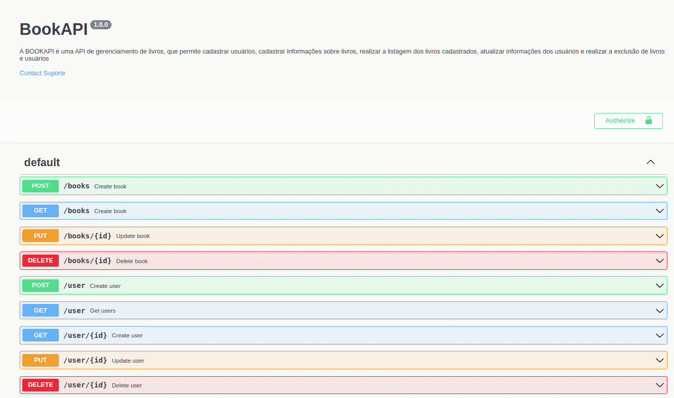

# 📚 BOOKAPI - Sistema de Controle de Leitura e Notas de Livros

<div align="center">


</div>

---

## Descrição 📝

A BOOKAPI é uma API de gerenciamento de livros, permitindo o cadastro de usuários, informações sobre livros, listagem de livros, atualização de usuários e exclusão de livros e usuários. Quando os usuários interagem com a API, eles têm a opção de adicionar e editar notas para os livros. Isso permite que os usuários mantenham um registro de suas observações e impressões sobre os livros que leram.

## Funcionalidades 📋

- Cadastro de Usuário
- Cadastro de Livro (name, author, company, read, dateRead, Description)
- Listagem de Livros
- Atualização de Usuário
- Exclusão de Livro
- Exclusão de Usuário
- Edição e Inserção de Notas para Livros

## Regras de Negócio 📘

- Não é possível cadastrar um usuário com um email já existente.
- Não é possível cadastrar o mesmo livro mais de uma vez.
- Não é possível deletar uma conta de usuário inexistente.
- Não é possível deletar um livro inexistente.
- Não é possível atribuir notas a um livro que ainda não foi lido.
- Não é possível atribuir nota a um livro que não foi lido.

## Configuração do Banco de Dados MongoDB Atlas 🛢️

Antes de executar o aplicativo, você precisa configurar um banco de dados MongoDB Atlas e obter a URL de conexão.

<details>
<summary> Passos para configurar o banco de dados:</summary>

1. Acesse [MongoDB Atlas](https://www.mongodb.com/cloud/atlas) e crie uma conta ou faça login, se ainda não o tiver feito.
2. Crie um novo projeto no MongoDB Atlas e configure um cluster, selecionando as opções desejadas.
3. Na seção "Database Access", crie um novo usuário com permissões de leitura e gravação para o banco de dados.
4. Na seção "Network Access", adicione o endereço IP da máquina onde o aplicativo será executado à lista de permissões.
5. No painel do MongoDB Atlas, clique em "Conectar" e escolha "Conectar seu aplicativo". Copie a URL de conexão fornecida.
6. Crie um arquivo `.env` no diretório raiz do projeto.
7. Copie o conteúdo do arquivo `.env.example` e cole-o no arquivo `.env`.
8. No arquivo `.env`, substitua o valor de `DB_URL` pela URL de conexão copiada na etapa 5.
9. Salve e feche o arquivo `.env`.

```dotenv
DB_URL=SUA_URL_DO_MONGODB_ATLAS

</details>

## Instalação e Execução 💻 ▶️

Siga as etapas abaixo para instalar e executar o projeto:

<details>

1. Certifique-se de ter o Node.js instalado em seu sistema.
2. Clone este repositório para o seu ambiente local.
3. Navegue até o diretório raiz do projeto.
4. No terminal, execute o seguinte comando para instalar as dependências do projeto:

   ```sh
   npm install

5. Após concluir as etapas de instalação e configuração, execute a aplicação com o seguinte comando:

   ```sh
   npm run dev

</details>


## Documentação Swagger 📖

A API é documentada usando o Swagger, o que facilita a visualização e teste das rotas disponíveis. Para acessar a documentação da API, siga estas etapas:

<details>

1. Certifique-se de que a aplicação esteja em execução.
2. Abra o seu navegador e acesse [http://localhost:3333/docs/v1/](http://localhost:3333/docs/v1/).
3. Você será direcionado para a interface interativa do Swagger, onde pode explorar todas as rotas disponíveis, seus parâmetros, exemplos de solicitação e respostas, bem como testar as rotas diretamente por meio da interface.



</details>

## :wrench: Tecnologias utilizadas

- Node.js

- Typescript

- MongoDB
